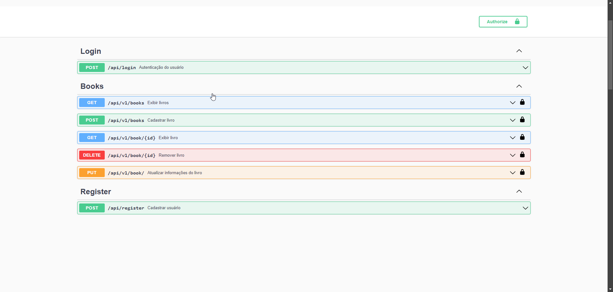

# 📚 API REST para Gerenciamento de Livros


Este projeto é uma API RESTful desenvolvida em Laravel para gerenciar um catálogo de livros. A API permite adicionar, consultar, atualizar e excluir livros do banco de dados.

## 🚀 Tecnologias Utilizadas

- **[Laravel](https://laravel.com/)**: Framework PHP para desenvolvimento de aplicações web.
- **[JWT-Auth](https://jwt.io/)**: Implementado para autenticação e autorização segura via JSON Web Token (JWT).
- **[L5 Swagger](https://github.com/DarkaOnLine/L5-Swagger)**: Implementado para gerar a documentação da API.

## 🌐 L5 Swagger
- `Link:` /api/documentation



## 📌 Endpoints

### 🔑 Autenticação

- `POST /api/v1/register`: Registra um novo usuário.
- `POST /api/v1/login`: Gera um token JWT para autenticação.

### 📖 Livros

- `GET /api/v1/books`: Retorna a lista de livros.
- `GET /api/v1/book/{id}`: Retorna os detalhes de um livro específico.
- `POST /api/v1/books`: Adiciona um novo livro.
- `PUT /api/v1/book/{id}`: Atualiza os dados de um livro existente.
- `DELETE /api/v1/book/{id}`: Exclui um livro.

## 🔐 Autenticação

Todos os endpoints (exceto `register` e `login`) exigem autenticação via token JWT. O token deve ser enviado no header `Authorization` no formato `Bearer {token}`.

## 🛠️ Instalação e Configuração

1. Clone o repositório:

   ```bash
   git clone https://github.com/seu-usuario/seu-repositorio.git
   cd seu-repositorio
   
2. Instale as dependências:

    ```bash
   composer install
   
3. Configure o arquivo .env:

   - Adicione as credenciais do banco de dados.
   - Configure a chave JWT
    
    ```bash
   php artisan jwt:secret

4. Execute as migrações:

    ```bash
   php artisan migrate

5. Inicie o servidor:

    ```bash
   php artisan serve
